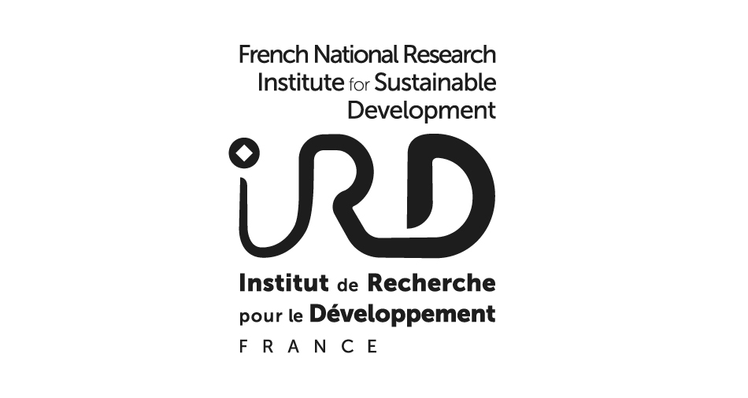

 

 

 

 

The International Certificate in Bioinformatics and Genomics (CIBiG) offers an intensive and concise training aimed at scientists at the intersection of mathematics, biology, and computer science.

This training provides a rapid acquisition of essential skills in bioinformatics and genomics. It includes acquiring the fundamental principles of bioinformatics, understanding sequencing techniques and their application, as well as using bioinformatics tools to automate the collection and management of sequencing data. Additionally, it aims to develop practical skills in the analysis and interpretation of these data.

9 September - 4 October 2024

The <a href="https://wave-center.org/" target_blank>WAVE Regional Center of Excellence</a>, Université Felix Houphouët Boigny, Bingerville, Abijan

2,000,000 CFA

 bioinfo@wave-center.org

Open application with selection : 15 places

 

 

 